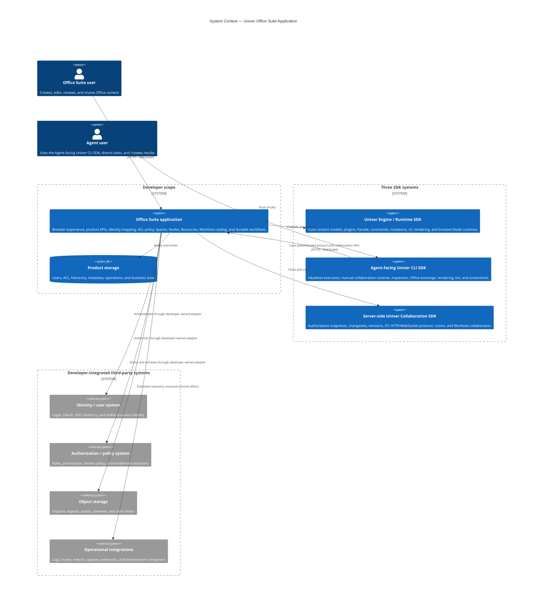
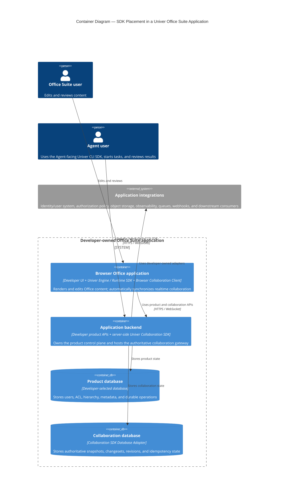
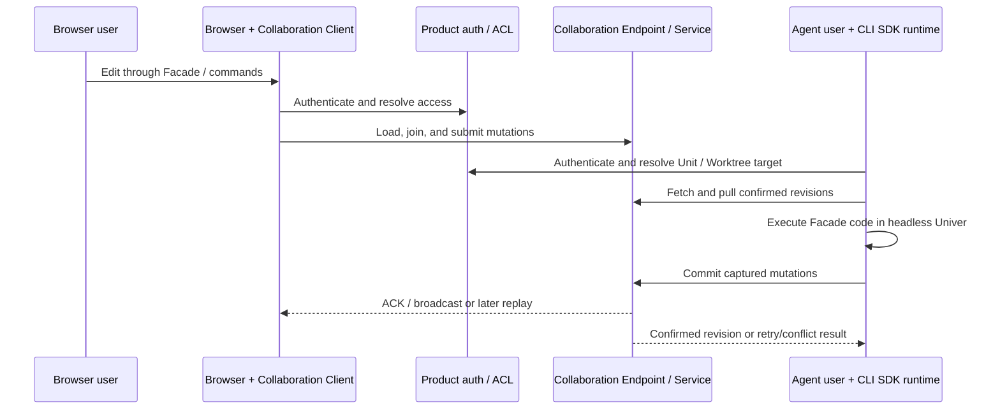
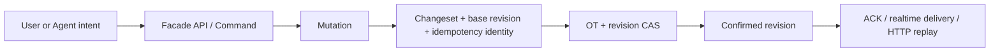
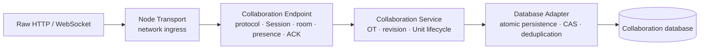

# Architecture

This chapter defines the system boundary of a Univer Office Suite application and the ownership
seams between DreamNum SDKs, developer-owned product code, and third-party systems.

It treats Univer and Univer Pro as one foundational **Univer Engine / Runtime SDK**, distinguishes
the **Agent-facing Univer CLI SDK** built on that runtime, and places the authoritative **Univer
Collaboration SDK** on the server side.

[简体中文](./architecture.zh-CN.md)

## System context

The SDK boundary provides content and collaboration primitives. It does not define the product's
users, permissions, hierarchy, sharing, target resolution, or business workflows. The developer
owns those policies and the adapters that connect external identity, authorization, storage, and
operations systems. A third-party service may execute a decision, but the application remains
responsible for mapping that decision to trusted SDK context and enforcing it on every path.

## Runtime containers and SDK placement

The product application is the composition root. Each SDK runs in a specific runtime; the SDKs do
not form a separate deployable product by themselves.

SDK placement is therefore explicit:

- **Univer Engine / Runtime SDK** is the foundation. It runs in the browser for interactive editing
  and inside the Agent-facing CLI runtime as a headless content engine.
- **Browser Collaboration Client** runs only in the browser and owns automatic realtime sync.
- **Univer CLI SDK** is Agent-facing and owns the bounded manual execution loop.
- **Univer Collaboration SDK** runs server-side in the application backend and owns authoritative
  collaboration state.
- **Product backend code** runs beside the Collaboration SDK, owns product policy, and calls its
  public Service contracts without taking ownership of collaboration internals.

The diagram groups the server-side product API and collaboration gateway into one backend to keep
the runtime view readable. They may share one process or be deployed separately. The CLI runtime
remains on the Agent user's client, and deployment does not change ownership.

## Two clients, one content authority

The browser client owns continuous realtime synchronization and presence. The CLI runtime owns an
explicit, bounded `fetch → pull → execute → commit` state machine. Never register the automatic
browser Collaboration Client in the same headless runtime; that would create competing sync owners.

## Content state and commands

Univer is plugin-based and can run in browser, Electron, Node, workers, and tests. Prefer Facade API
for application behavior; use plugins, dependency injection, and command APIs for deeper product
extensions.

A snapshot is persisted data, not mutable live state. Editing a snapshot does not update the running
application. Change live content through Facade or commands; mutations are the smallest units
transformed by collaboration.

## Server-side Collaboration SDK internals

These are complementary layers, not alternative integration choices. The legacy Univer Server
integration is deprecated and unsupported; new applications must use the Collaboration SDK.

## Control plane and content plane

Product APIs form the control plane: identity, Space/Node hierarchy, Resource metadata, ACL,
sharing, trash, recent items, Worktree catalog, task state, and durable operations. Collaboration
routes form the content plane: Unit snapshots, blocks, confirmed changesets, submit, Session, room,
presence, and Worktree-scoped content.

Both planes may reuse the same in-process identity and access-policy modules. They should not call
each other over HTTP merely to ask the same process for authorization.

## Identity vocabulary

| Term | Owner and meaning |
| --- | --- |
| application user ID / `userID` | Developer-owned stable identity mapped into trusted SDK context; confirmed author |
| `memberID` | Collaboration Endpoint identity for one online Session; changes after reconnect |
| `sid` + `reqId` | Collaboration client/runtime submission idempotency identity; preserved across retries |
| Unit ID | Collaboration identity, globally unique within a Service/database |
| Resource ID | Product metadata identity referring to a Unit |
| Node ID | Product hierarchy entry in a Space |
| Worktree ID | Isolated draft and review scope shared by product catalog and Worktree services |

Client payloads cannot establish trusted user identity, membership ownership, or confirmed
revision. Resolve those facts from authenticated server state.

## Authentication and authorization paths

Ordinary collaboration HTTP requests authenticate in Transport middleware. A Session-ticket
request captures trusted context in an opaque one-time ticket; WebSocket open consumes it to create
an Endpoint Session.

- Endpoint JOIN protects entry to a realtime room.
- Service read middleware protects snapshots and missing-changes HTTP reads.
- Service submit middleware protects authoritative content changes.
- Create, delete, restore, History, Comment, and Worktree each require their own policy coverage.

A JOIN check alone does not protect HTTP reads. Client-side read-only UI does not replace server
authorization.

## Persistence, delivery, and lifecycle

The collaboration database is authoritative; WebSocket is a low-latency delivery channel. A commit
may succeed even if realtime delivery fails, so clients recover confirmed changesets from their
known revision.

Product and collaboration data have separate owners, even if development uses one physical SQLite
file. Cross-store workflows require idempotency, durable operation state, explicit steps, and
recovery—not a claimed shared transaction.

Retryable apply/commit stages may run more than once. Emit irreversible effects only after commit;
use a transactional outbox when external delivery must be reliable.

Database CAS can preserve authoritative correctness across multiple Service instances. Room,
presence, ACK, and broadcast guarantees are scoped to one Endpoint process unless the
application adds an explicit realtime distribution design.

Dispose from the network edge inward. Transport disposes registered Endpoints; Endpoint does not
dispose Service; Service does not dispose an externally injected Database Adapter.
