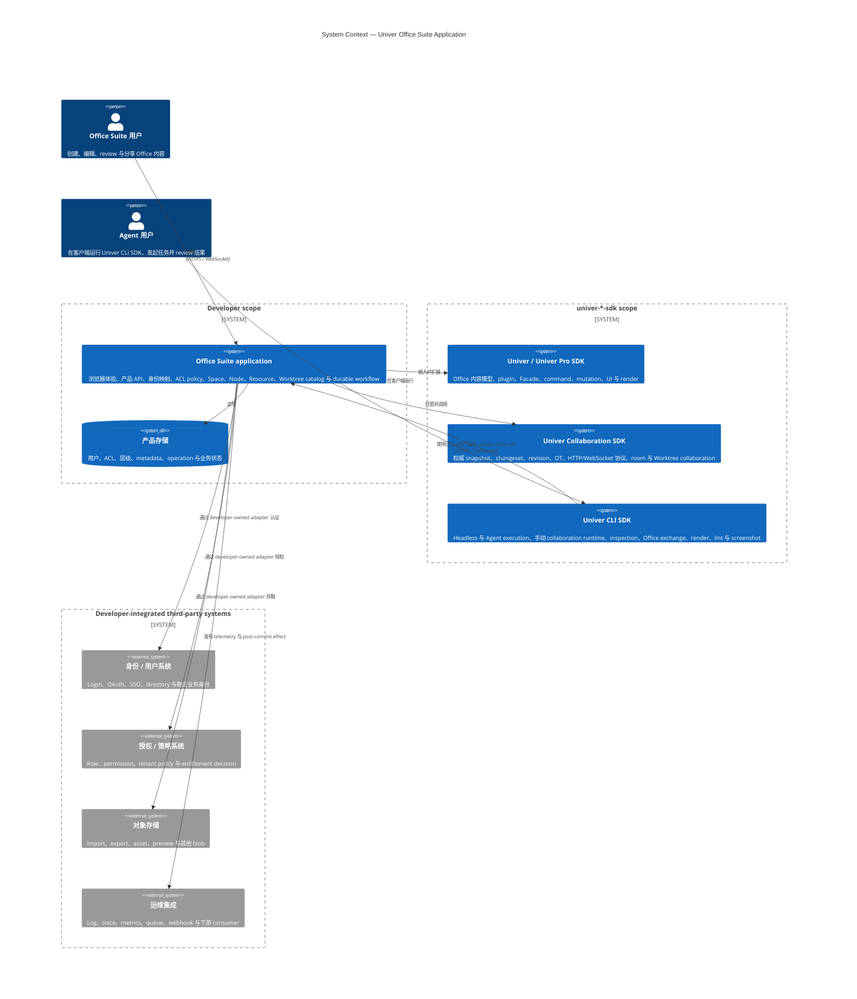
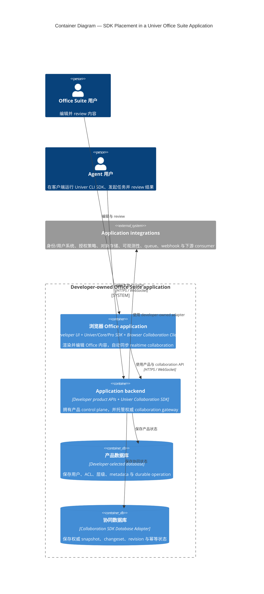
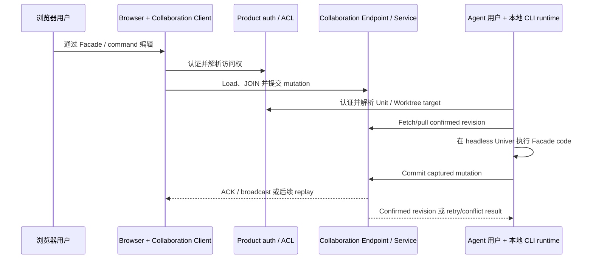
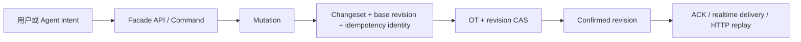
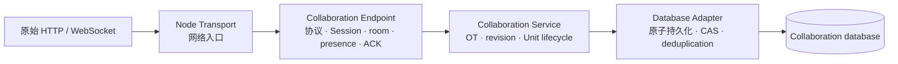

# 架构

本章定义 Univer Office Suite application 的系统边界，以及 DreamNum SDK、developer-owned 产品
代码和第三方系统之间的所有权边界。

[English](./architecture.md)

## 系统上下文

SDK 边界提供内容与协同 primitive，但不定义产品用户、权限、层级、分享、target resolution 或
业务 workflow。Developer 拥有这些 policy，以及连接外部身份、授权、存储和运维系统的 adapter。
第三方服务可以执行认证或策略决策，但应用仍负责把结果映射成可信 SDK context，并在每条路径
执行这些决策。

## Runtime container 与 SDK 位置

产品应用是 composition root。每个 SDK 都运行在明确的 runtime 中；这些 SDK 本身不会组成一个
独立部署的成品应用。

因此，各 SDK 的运行位置非常明确：

- **Univer/Core/Pro SDK** 在浏览器中提供交互式编辑，并在本地 CLI runtime 中作为 headless
  内容引擎。
- **Browser Collaboration Client** 只运行在浏览器中，拥有自动 realtime sync。
- **Univer CLI SDK** 运行在 Agent 用户的客户端，拥有有边界的 manual execution loop。
- **Univer Collaboration SDK** 运行在 application backend 中，拥有权威协同状态。
- **产品后端代码**与 Collaboration SDK 共同运行，拥有产品 policy，并调用其公开 Service
  contract，但不拥有 collaboration internals。

为了保持 runtime 视图清晰，图中把 server-side product API 与 collaboration gateway 合并为一个
backend。它们可以共享同一进程，也可以分开部署。CLI runtime 保留在 Agent 用户的客户端，部署
方式不会改变所有权。

## 两类 client，一个内容权威

浏览器 client 拥有持续 realtime synchronization 与 presence；CLI runtime 拥有显式、有边界的
`fetch → pull → execute → commit` 状态机。不得在同一个 headless runtime 注册自动浏览器
Collaboration Client，否则会形成两个互相竞争的同步所有者。

## 内容状态与 command

Univer 基于 plugin，可运行在浏览器、Electron、Node、worker 与测试环境。应用行为优先使用
Facade API；更深的产品扩展使用 plugin、依赖注入与 command API。

Snapshot 是持久化数据，不是可变 live state。修改 snapshot 不会更新运行中的应用。Live content
必须通过 Facade 或 command 修改；mutation 是协同转换的最小单元。

## Collaboration SDK 内部分层

这些层彼此互补，不是不同 integration 方案。Legacy Univer Server integration 已废弃且不受支持；
新应用必须使用 Collaboration SDK。

## Control plane 与 content plane

产品 API 构成 control plane：身份、Space/Node 层级、Resource metadata、ACL、分享、trash、recent、
Worktree catalog、task state 与 durable operation。Collaboration routes 构成 content plane：Unit
snapshot、block、confirmed changeset、submit、Session、room、presence 与 Worktree-scoped content。

两条 plane 可以复用同一组进程内身份与访问策略模块，但不应为了向同一进程查询权限而互相发
HTTP 请求。

## 身份词汇

| 名称 | 所有者与含义 |
| --- | --- |
| application user ID / `userID` | Developer-owned 稳定身份，映射到可信 SDK context；也是 confirmed author |
| `memberID` | Collaboration Endpoint 创建的一次在线 Session 身份；重连后变化 |
| `sid` + `reqId` | Collaboration client/runtime 提交幂等身份；重试时保持不变 |
| Unit ID | Collaboration 身份，在一个 Service/database 内全局唯一 |
| Resource ID | 指向 Unit 的产品 metadata 身份 |
| Node ID | Space 中的产品层级节点 |
| Worktree ID | 产品 catalog 与 Worktree service 共同使用的隔离 draft/review scope |

Client payload 不能建立可信用户身份、member 归属或 confirmed revision；必须从服务端认证状态解析。

## 认证与授权路径

普通 collaboration HTTP request 在 Transport middleware 中认证。Session-ticket request 把可信
context 保存到 opaque one-time ticket；WebSocket open 消费它并创建 Endpoint Session。

- Endpoint JOIN 保护进入 realtime room。
- Service read middleware 保护 snapshot 与 missing-changes HTTP read。
- Service submit middleware 保护权威内容修改。
- Create、delete、restore、History、Comment 与 Worktree 分别需要 policy 覆盖。

只检查 JOIN 不能保护 HTTP read；client-side readonly UI 也不能替代服务端授权。

## 持久化、投递与生命周期

Collaboration database 是权威状态，WebSocket 是低延迟投递通道。即使 realtime delivery 失败，
commit 仍可能成功；client 根据已知 revision 拉取 confirmed changeset 完成恢复。

产品数据和协同数据拥有不同所有者，即使开发环境使用同一个物理 SQLite 文件。跨存储 workflow
必须使用幂等、durable operation state、显式步骤与恢复，不能宣称共享 transaction。

可重试 apply/commit stage 可能执行多次。不可逆 effect 只能在 commit 后触发；可靠外部投递使用
transactional outbox。

Database CAS 可以保持多个 Service instance 的权威数据正确性。当前 room、presence、ACK 与
broadcast 保证只覆盖单个 Endpoint process，除非应用显式增加 realtime distribution design。

从网络边缘向内释放资源。Transport 释放已注册 Endpoint；Endpoint 不释放 Service；Service
不释放外部注入的 Database Adapter。
