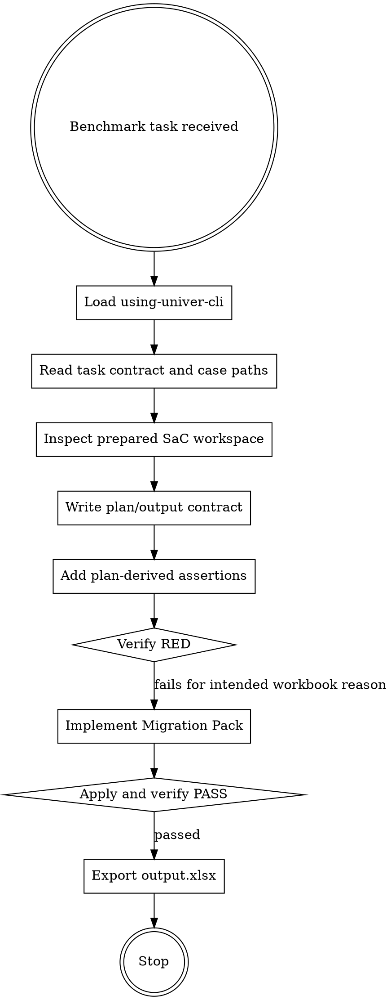

# Benchmarking Univer CLI

Benchmarking Univer CLI is the solver protocol for non-interactive workbook benchmark tasks. It
wraps the Univer skill stack with benchmark-specific constraints: `/task` boundaries, prepared SaC
workspaces, `answer_position`, no hidden-answer access, and required `output.xlsx` handoff files.

This skill is for solver agents only. It does not run benchmark pipelines, analyze reports, or
maintain wrong-answer matrices.

<EXTREMELY-IMPORTANT>
IF YOU ARE SOLVING A SPREADSHEETBENCH TASK INSIDE `/task`, YOU MUST USE THIS SKILL BEFORE TOUCHING
ANY WORKBOOK.

THE PREPARED SAC WORKSPACE IS THE ONLY SOLVING SOURCE.

DO NOT FALL BACK TO DIRECT WORKBOOK MUTATION.
</EXTREMELY-IMPORTANT>

## The Rule

Follow this order before exporting any result:

1. **Load using-univer-cli** before any workbook command. Then use the SaC route:
   `writing-univer-plans`, `executing-univer-plans`, and
   `test-driven-univer-spreadsheet-development`.
2. **Read task contract and case paths**: instruction, case list, prepared workspace paths,
   managed artifact paths, `answer_position`, preview text, and output paths.
3. **Inspect prepared SaC workspace** and workbook-visible evidence before deciding ranges,
   formulas, boundaries, or semantic mappings.
4. **Write plan/output contract** before source changes. Include final target shape,
   source-to-target mapping, ordering policy, value/formula semantics, preservation rules,
   negative constraints, and uncertainty.
5. **Add plan-derived assertions** for workbook-visible effects and high-risk decisions.
6. **Verify RED** with `univer sac verify <workspace> --json`; the assertion must fail for the
   intended workbook reason before migration implementation.
7. **Implement Migration Pack** only after RED.
8. **Apply and verify PASS**; inspect `verify-report.json` and ensure changed packs are checked.
9. **Export output.xlsx** only after verification passes.

## Benchmark Hard Gates

- Use only files under `/task`.
- Each case is independent. Write exactly the requested `/task/outputs/case_N/output.xlsx`.
- The prepared SaC workspace is the only solving source: `/task/cases/case_N/sac`.
- The managed artifact is `/task/cases/case_N/sac/artifacts/sac.univer`.
- Do not read, copy, import, parse, inspect, or modify `input.xlsx`.
- Do not treat `input.univer` as the solving source; it is a runner intermediate.
- Do not read hidden answers, golden workbooks, `answer.xlsx`, host checks, or evaluation artifacts.
- Do not run `univer sac init --from` again.
- Do not run `univer config set experimental.sac true`; the benchmark image already configures SaC.
- Do not run `pnpm install` during normal solving. If a SaC command proves dependencies are missing
  or invalid, run `CI=true pnpm install --prefer-offline` inside that workspace, then retry the same
  command.
- Do not use direct `univer run`, `pipe in`, or package edits to mutate the final workbook.
- `univer run` is allowed only for readonly probes after passed SaC apply/verify or for debugging
  failed verification, and probe findings must be converted back into plan/assertion/source.
- If SaC cannot produce an artifact, fail the task rather than creating `output.xlsx` through direct
  workbook mutation.

## Required References

Load `references/evaluator-and-answer-position.md` before interpreting `answer_position`, large
answer ranges, structural changes, sort/filter/group/truncate semantics, or high-risk mappings.

Load `references/univer-facade-benchmark-pitfalls.md` before writing or reviewing Migration Pack
code, Facade scripts, copy/move logic, formatting-sensitive values, formulas, rich text, active
sheet state, or cell model verification.

## Non-Interactive Decisions

This is a benchmark; you cannot ask the user to clarify hidden intent. If a required high-risk
decision remains underdetermined after inspecting workbook evidence, proceed only when necessary,
choose the best rule that follows the instruction and target layout, and keep the uncertainty
visible in the plan, assertions, readonly probes, and final handoff.

Never present an underdetermined assumption as workbook-proven evidence.

## Passing Gate

Before exporting:

- the relevant `univer sac verify <workspace> --json` status is `passed`
- changed packs have assertion evidence
- zero-assertion, all-skipped, and unchecked changed-pack runs are not completion signals
- readonly probes are auxiliary evidence only
- no hidden answer or host evaluation artifact was used

After export, stop. Do not keep probing or re-exporting unless verification or export failed.
