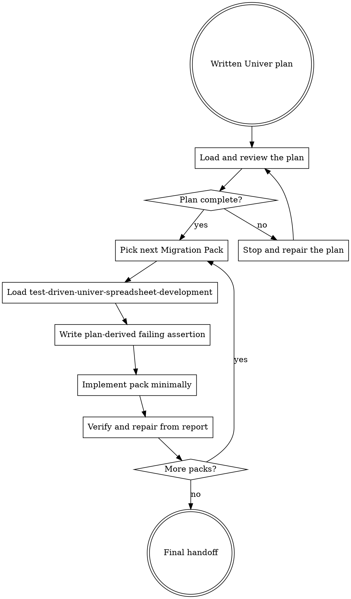

# Executing Univer Plans

Execute a written Univer workbook plan pack-by-pack. This skill turns the plan into SaC source work
without losing the workbook-domain contract.

<EXTREMELY-IMPORTANT>
Do not execute a complex SaC workbook task without a plan written by `writing-univer-plans`.

IF THE PLAN IS INCOMPLETE, STOP AND REPAIR THE PLAN BEFORE WRITING ASSERTIONS OR MIGRATION PACKS.
</EXTREMELY-IMPORTANT>

## The Rule

Review the workbook plan before touching execution files, then use test-driven spreadsheet
development for each pack.

## Load and Review the Plan

Before editing `assertions.ts` or `migrations/`, read the plan critically.

Confirm it includes:

- workbook-visible goal and explicit non-goals
- baseline evidence and readonly probes already used
- range roles with read/write/preserve rules
- workbook behavior contract fields relevant to the task
- Contract Decision Evidence for high-risk decisions
- Migration Pack sequence
- assertion gate for every non-trivial changed pack
- completion verify command

If any item is missing, Stop and repair the plan. Do not proceed from memory.

## Stop and Repair the Plan

Repair the plan before execution when:

- a range role is unclear
- a high-risk decision lacks evidence strength
- an assumption is hidden or presented as proof
- a pack has no durable workbook intent
- a pack has no assertion gate
- the verify command is missing
- the plan conflicts with observed workbook evidence

Plan repair may require readonly `univer` probes. Capture useful findings back into the plan before
continuing.

## Execute one Migration Pack at a time

For each pack:

1. Mark the pack as the current execution unit.
2. Load `test-driven-univer-spreadsheet-development`.
3. Write or update the plan-derived assertion gate first.
4. Run `univer sac verify <workspace> --json` and confirm the assertion fails for the intended
   workbook-visible reason.
5. Implement the minimal Migration Pack change that should satisfy the assertion.
6. Run apply/verify as required by the TDD skill.
7. Read `.sac/runs/<run-id>/verify-report.json` and repair from evidence.
8. Update the plan if execution reveals a behavior contract change.
9. Move to the next pack only after the current pack has meaningful passed assertion evidence.

Do not edit Migration Packs while the plan has missing assertion gates.
Do not batch multiple packs into one unchecked implementation step.

## Review Gates

After each pack, check:

- Did the assertion fail before implementation for the right reason?
- Does the passed assertion prove workbook-visible behavior, not only command success?
- Are preservation and negative constraints covered?
- Did execution discover a plan change that must be recorded?
- Did any pack get skipped, or does any changed pack still have zero assertions?

## When to Stop and Ask

Stop rather than guessing when:

- underdetermined assumptions affect user-visible workbook behavior
- the plan and workbook evidence disagree
- verify repeatedly fails but the report does not identify a clear source/assertion split
- required workbook artifacts are missing
- a non-Univer spreadsheet-library fallback appears necessary

## Red Flags

These thoughts mean STOP:

| Thought | Reality |
| --- | --- |
| "The plan is mostly complete; I can fill gaps while coding." | Execution depends on a complete workbook contract. |
| "I'll implement the pack, then write assertions." | Each pack needs a plan-derived failing assertion first. |
| "Several packs are related, so I'll implement them together." | Pack-level evidence disappears when execution is batched. |
| "The verify command passed once, so all packs are done." | Changed packs need meaningful assertion evidence. |
| "I can fix a failed assertion by matching the migration output." | Decide whether the source or assertion is wrong from workbook evidence. |

## Final Handoff

The handoff must include:

- plan path
- executed Migration Pack sequence
- verification command
- final status
- `verify-report.json` path
- assertion evidence for each changed pack
- skipped packs, if relevant
- assumptions that remain underdetermined
