# Test-Driven Univer Development

Test-Driven Univer Development is univerfile sidecar SaC TDD for Univer workbooks. Behavior is
complete only when assertion contracts prove the changed packs through `univer sac verify`.

This is not generic code TDD. The goal is correct univerfile sidecar behavior through source,
runtime, and assertion evidence. For spreadsheet projects, that includes Excel domain semantics, range roles,
formulas, computed values, formatting, validation, protection, preservation, and negative
constraints.

<EXTREMELY-IMPORTANT>
NO MIGRATION PACK IMPLEMENTATION WITHOUT A PLAN-DERIVED FAILING ASSERTION FIRST.

If you wrote migration source before the assertion failed for the intended workbook-visible reason:
delete or revert that premature migration source change and restart from the plan-derived assertion
gate.

No exceptions:

- Do not keep it as reference.
- Do not adapt it while writing assertions.
- Do not leave it commented out.
- Implement fresh from the plan-derived failing assertion.

If the premature source is mixed with pre-existing user or project changes, isolate and discard only
your premature source. Do not revert unrelated work.
</EXTREMELY-IMPORTANT>

## When to Use

Use this skill for:

- new or changed Facade Migration Packs
- `assertions.ts` coverage
- `univer sac apply` or `univer sac verify` repair loops
- workbook-visible behavior changes in univerfile sidecar SaC source
- refactoring SaC source while preserving workbook behavior

Exceptions require explicit user agreement and must be recorded in the handoff.

## Operating Contract

- Use `writing-univer-plans` first for complex workbook behavior.
- Use `executing-univer-plans` when following a written plan pack-by-pack.
- For complex workbook behavior, assertions trace to the plan, and the plan traces to
  `<hidden-sidecar>/success-criteria/<topic>.md`; do not bypass either source artifact.
- For unit-specific behavior, the plan and assertions must identify the target `.univer` path,
  relevant `localUnitId`, unit type, and spreadsheet sheet/range coordinates when applicable.
- Treat `assertions.ts` as the workbook-visible contract for each non-trivial changed pack.
- Treat `<hidden-sidecar>/types/` as the local Facade API reference for SaC migration source.
- Treat `<hidden-sidecar>` as the `sidecarPath` resolved by SaC commands, and read verify
  `reportPath` from JSON instead of constructing `<target>.sac/runs/...`.
- Allow bounded bootstrap or readonly probes when needed, but never use them as final completion
  evidence.
- Do not claim completion from `univer sac apply` success.
- Do not claim completion from a zero-assertion, all-skipped, or unchecked changed pack verify run.
- Do not create empty or no-op Migration Packs just to satisfy pack structure or simulate a RED gate.

## Testing Anti-Patterns Reference

Load this reference when writing or changing assertions, creating workbook fixtures, using readonly
probes as proof, or tempted to add test-only migration or facade methods:
`testing-anti-patterns.md`.

The reference covers migration echo, readonly probe completion claims, partial workbook fixtures,
test-only production surface, rationalizations, and STOP conditions.

## Good Assertions

| Quality | Good | Bad |
| --- | --- | --- |
| Minimal | One workbook behavior decision per assertion | One broad snapshot covering many rules |
| Clear | Names the sheet, range, and behavior being proved | `assert output is correct` |
| Domain-grounded | Derives expected values from plan evidence | Copies whatever the migration wrote |
| Runtime-aware | Checks computed values when formulas matter | Checks formula text only |

## Why Order Matters

Assertions written after migration source are biased by implementation. They answer "what did this
migration write?" instead of "what workbook behavior should exist?"

Plan-derived failing assertions force Excel-domain decisions to happen before code. Watching the
assertion fail proves the gate catches missing behavior. Passing later proves the Migration Pack
satisfied that workbook contract.

Manual preview, `univer sac apply`, and readonly probes are useful evidence, but they are not a
repeatable completion gate. The repeatable gate is `univer sac verify <univerfile> --json` plus
the returned assertion evidence.

## Red-Green-Repair

```dot
digraph test_driven_univer_development {
    rankdir=LR;
    red [label="RED\nPlan-derived assertion", shape=box, style=filled, fillcolor="#ffcccc"];
    verify_red [label="Verify fails\nfor right workbook reason", shape=diamond];
    green [label="GREEN\nMinimal Migration Pack", shape=box, style=filled, fillcolor="#ccffcc"];
    verify_green [label="Verify passes\nwith report evidence", shape=diamond];
    repair [label="REPAIR\nSource, assertion, or plan", shape=box, style=filled, fillcolor="#ccccff"];
    next [label="Next pack", shape=ellipse];

    red -> verify_red;
    verify_red -> green [label="yes"];
    verify_red -> red [label="wrong failure"];
    green -> verify_green;
    verify_green -> repair [label="no"];
    verify_green -> next [label="yes"];
    repair -> verify_green [label="stay green"];
}
```



Use the smallest loop that protects the workbook contract:

1. Write the plan-derived assertion or repair the assertion source.
2. Confirm the assertion is independent of the implementation output.
3. Implement the minimal Migration Pack change.
4. Run apply/verify as needed and read the returned report evidence.
5. Repair the plan, assertion, or migration when the evidence disagrees.

### RED - Write the Assertion First

Derive assertions from the plan: user intent, baseline evidence, unit scope, range roles,
final-layout reasoning, and Contract Decision Evidence.

Do not derive assertions from whatever the migration happened to write.

Assertions should cover:

- workbook-visible final state: sheets, used ranges, headers, representative values, formulas, and
  computed values
- unit-aware target scope: target `.univer` path, `localUnitId`, unit type, sheet names, and A1
  ranges when relevant
- Excel domain semantics: signs, categories, period boundaries, text casing, blank-versus-zero,
  blank-versus-error placeholders, singular/plural label preservation, stored value type,
  display-critical values, and formula behavior
- range role preservation: source data, helper/control input, lookup/reference, example/demo,
  existing output, and preserve-only ranges
- boundary and negative constraints: no extra headings, no helper sheets, cleared tails, no
  unintended overwrite, no unwanted formatting changes
- report schema boundaries: last body row, summary/footer label, footer amount/formula or stored
  value, spacer columns, and first true blank tail row for aggregate, summarize, split, report,
  rebuild, or consolidation tasks
- region boundaries: managed overview `regions` when side-by-side tables, uneven table heights, or
  region-specific tail/footer evidence could be hidden by one sheet-level sample
- style/export safety: valid `#RRGGBB` or documented color strings, expected number formats, and
  export-compatible workbook-visible values when styles or formulas are involved
- workbook-behavior contract decisions: output shape, sorting, grouping, mapping,
  value/formula semantics, formatting/presentation, interaction/validation/protection,
  preservation, and negative constraints
- value evidence through the right helper: `values`, `rawValues`, `displayValues`, `cellData`,
  `numberFormats`, or formula assertions
- meaningful cases: first, middle, last, blank, zero, date-boundary, text-boundary, and
  grouping-boundary rows when relevant

Keep assertions small and deterministic. Prefer representative ranges over broad workbook snapshots.

### Verify RED - Watch It Fail

`univer sac verify <univerfile> --json` verifies applied packs. It does not apply pending source just
to test assertions. For a brand-new pending pack, the RED gate is established by writing the
plan-derived assertion before implementation and confirming that the missing behavior is still absent
from workbook-visible baseline evidence.

Only run verify for RED when the target pack is already applied or when you are repairing an applied
pack and expect its assertion to fail. When you run verify, confirm:

- the changed pack is actually checked in the JSON summary
- the assertion fails
- the failure is about the intended workbook-visible behavior
- the failure is not a typo, missing fixture, setup error, stale apply state, skipped pack, or invalid assertion

These are not valid RED gates:

- `SAC_EMPTY_MIGRATION_PACK`
- `SAC_PACK_FILE_INVALID`
- `checkedPacks: 0`, `checkedPackCount: 0`, or an all-skipped run
- a no-op sheet migration whose pack is skipped because it has not been applied
- a verify pass that does not check the changed pack's assertions

If verify cannot check the changed pack yet, do not add an empty/no-op pack just to make verify run.
The next GREEN step may create the minimal real migration source only after the assertion file exists
and baseline evidence confirms the behavior is missing.

If an assertion passes immediately for a changed pack that verify actually checked, it is not a useful
gate for new behavior. Strengthen it or choose the next missing behavior from the plan.

### GREEN - Implement the Minimal Pack Change

Edit the Migration Pack only after the applicable RED gate exists: for an already-applied pack, the
assertion fails for the intended reason; for a brand-new pending pack, the plan-derived assertion
exists and baseline evidence confirms the behavior is missing.

Implement only what the current pack and assertion require. Do not add unrelated sheets, helper
ranges, broad formatting, or future behavior.

Use the current SaC source contract: `pack.ts` owns pack-level `description`, `files`, and
`unitMigrations`; unit migration files use `defineUnitMigration({ apply({ univerAPI }) { ... } })`.
Do not add unit migration `title`, call active workbook entrypoints, or write `apply` handlers
that expect `{ workbook }`, `{ sheet }`, or `{ univerfile }`.

### Verify GREEN - Use the Report

Run apply when the relevant migration is not yet applied, then verify:

```bash
univer sac apply <univerfile>
univer sac verify <univerfile> --json
```

The target must be clean before apply and verify. If verify reports setup/error evidence for
uncommitted local mutations, commit or restore those mutations before judging assertion behavior.

Read the JSON summary and returned assertion evidence.

Confirm that the changed pack is checked and has at least one passed assertion. A zero-assertion,
all-skipped, or unchecked changed-pack run is not GREEN.

If status is `failed`, inspect pack id, assertion kind, target, expected value, actual value, and
first difference when present. Decide whether the migration source or assertion expectation is wrong
before changing either.

If status is `error`, fix setup, config, missing target, source validation, bundling, or runtime setup
before judging workbook behavior.

If a pack has already been applied and later needs behavior changes, do not keep editing that applied
pack into a hash mismatch loop. Prefer a new follow-up Migration Pack that repairs the behavior and
has its own assertions.

### REPAIR - Keep the Contract Honest

Readonly probes such as materialized sidecar evidence, sidecar `univer inspect` scripts,
`univer view`, or assertion readback evidence may help debug failures. Convert useful probe findings
back into the plan, migration source, or assertions, then return to `univer sac verify`.

If verification changes expected behavior, update the plan before or alongside source/assertion
repairs.

## Assertion Coverage Rules

Choose assertions from the workbook decisions the plan actually makes. A changed pack needs
meaningful assertion evidence, but coverage should be discriminating rather than exhaustive
ceremony.

For high-risk decisions that affect changed workbook state, prefer at least one assertion or bounded
readonly probe that would reject a plausible wrong rule. If the workbook evidence remains
underdetermined, record that assumption in the plan and handoff instead of treating an assertion as
proof that the assumption was workbook-proven.

Choose assertion evidence by the workbook decision:

- use normalized inspect evidence for ordinary labels, copied text, matching, grouping, and write
  decisions before translating the plan into `values` or `rawValues` assertions
- use `values` or `rawValues` when numeric, date, boolean, text, blank, zero, or error identity
  matters after the plan has chosen the stored-value contract
- use `displayValues` when the visible formatted string is the contract
- use `cellData` when type, formula cache, style id, or cell model shape is the evidence
- use `numberFormats` when number/date/percent/currency interpretation matters
- use `styles` or `backgroundColors` when static visual formatting such as fill, font color,
  boldness, alignment, wrapping, or borders is the workbook-visible contract
- use `conditionalFormats`, `filter`, or `tables` when the task creates or changes native
  conditional formatting rules, sheet filters, or table resources
- use formula assertions when formula structure matters independently of calculated values
- use sheet, used-range, and representative range assertions for structure and preservation

Decision-specific coverage reminders:

- sort/group/truncation decisions: use boundary rows such as first, middle, last, or first excluded
  candidate when those rows distinguish the chosen ordering rule
- mapping decisions: use representative source-to-target coordinates, including category, sign,
  blank/zero, or boundary mappings that decide the behavior
- text decisions: check exact casing, whitespace, abbreviations, singular/plural wording, and stored
  value type when those details are part of the visible contract; rely on normalized text evidence by
  default, and assert raw/control-character preservation only when the plan cites explicit exact
  storage or cell model evidence
- structural decisions: verify section headers, segment boundaries, and first/last row after the
  final layout is determined when they affect the output contract
- report-schema decisions: when a target area has `TOTAL`, `SUBTOTAL`, `SUM(...)`, footer labels, or
  template formulas, verify the chosen policy: rebuild, move, recompute, preserve, or intentionally
  delete; check the first true blank tail row when it is part of the contract
- blank/error decisions: use a no-match or missing-data row when it distinguishes real blank from
  `#N/A`, `n/a`, spaces, NBSP, or zero
- date-window decisions: check enough boundary rows to distinguish inclusive/exclusive or rolling
  window behavior
- stale/example target decisions: when existing target values could be stale examples or partial
  output, use a counterexample that would fail if those values were incorrectly preserved
- style/resource decisions: verify normalized color strings and Facade-visible resource semantics
  with `styles`, `backgroundColors`, `conditionalFormats`, `filter`, or `tables`; exported workbook
  compatibility can be supplemental, but value-only assertions are not enough for resource tasks

A passed assertion that only mirrors the migration output is not enough when the underlying semantic
decision was ambiguous. If the same assertion would pass for the plausible wrong rule, strengthen it
or add a readonly probe before treating the pack as GREEN.

Do not treat a passing assertion as GREEN if it only confirms copied existing target values without
proving they match the instruction-derived workbook behavior.

For exact-value decisions, assertions should prove the workbook-visible contract rather than the
implementation's preferred normalization. Cover casing, whitespace, punctuation, identifiers, stored
value type, dates, booleans, blanks, zeroes, and error placeholders when those details are visible or
were part of a high-risk decision; avoid locking raw artifacts into the contract unless evidence says
they are user-visible output.

Assertions cannot turn an underdetermined assumption into workbook-proven truth. When the plan marks
a decision as `underdetermined assumption`, assertions should verify that the implementation
consistently applies the declared assumption, and the final handoff should preserve that uncertainty
instead of presenting it as decisive workbook evidence.

## Passing Gate

For non-trivial SaC TDD handoff:

- the latest relevant `univer sac verify <univerfile> --json` status must be `passed`
- every pack created or modified for the task must be checked unless explicitly assertion-free
- each changed pack must have at least one passed assertion
- skipped packs must be mentioned when relevant
- zero-assertion and all-skipped runs are not completion signals

## Final Handoff

When an external harness supplies a delivery or stop gate, follow that harness after the latest
relevant verify passes. Do not keep collecting auxiliary evidence after the required handoff artifact
is created.

The final handoff must include:

- plan outcome and pack sequence
- verification command
- final status
- changed pack assertion evidence
- skipped packs, if relevant
- auxiliary probes used, if any, and why they were not completion evidence
