# Test-Driven Univer Spreadsheet Development

Test-Driven Univer Spreadsheet Development is SaC adapted TDD: workbook behavior is complete only
when assertion contracts prove the changed packs through `univer sac verify`.

This is not generic code TDD. The goal is correct spreadsheet behavior: Excel domain semantics,
range roles, formulas, computed values, formatting, validation, protection, preservation, and
negative constraints.

<EXTREMELY-IMPORTANT>
NO MIGRATION PACK IMPLEMENTATION WITHOUT A PLAN-DERIVED FAILING ASSERTION FIRST.

If you wrote migration source before the assertion failed for the intended workbook-visible reason,
Delete or revert the migration source change and restart from the plan-derived assertion gate.

No exceptions:

- Do not keep it as reference.
- Do not adapt it while writing assertions.
- Do not leave it commented out.
- Implement fresh from the plan-derived failing assertion.
</EXTREMELY-IMPORTANT>

## Operating Contract

- Use `writing-univer-plans` first for complex workbook behavior.
- Use `executing-univer-plans` when following a written plan pack-by-pack.
- Treat `assertions.ts` as the workbook-visible contract for each non-trivial changed pack.
- Allow bounded bootstrap or readonly probes when needed, but never use them as final completion
  evidence.
- Do not claim completion from `univer sac apply` success.
- Do not claim completion from a zero-assertion, all-skipped, or unchecked changed pack verify run.

## The Iron Laws

```
1. NEVER test migration echo.
2. NEVER add test-only migration or facade methods.
3. NEVER mock workbook or runtime structures without understanding their side effects.
```

Testing migration echo means asserting the values, formulas, formats, or ranges only because the
migration wrote them. Assertions must prove workbook behavior promised by the plan.

Test-only migration or facade methods are production surface area. If cleanup, probing, or setup is
needed only for tests, keep it in assertion helpers or readonly probes, not in Migration Packs.

Workbook and runtime mocks are risky because formula calculation, formatting, validation,
protection, and sheet state have side effects. If a mock hides behavior the assertion depends on, use
a lower-level test double or a real workbook probe instead.

## Red-Green-Repair

```dot
digraph test_driven_univer_spreadsheet_development {
    rankdir=LR;
    red [label="RED\nPlan-derived assertion", shape=box, style=filled, fillcolor="#ffcccc"];
    verify_red [label="Verify fails\nfor right workbook reason", shape=diamond];
    green [label="GREEN\nMinimal Migration Pack", shape=box, style=filled, fillcolor="#ccffcc"];
    verify_green [label="Verify passes\nwith report evidence", shape=diamond];
    repair [label="REPAIR\nSource, assertion, or plan", shape=box, style=filled, fillcolor="#ccccff"];
    next [label="Next pack", shape=ellipse];

    red -> verify_red;
    verify_red -> green [label="yes"];
    verify_red -> red [label="wrong failure"];
    green -> verify_green;
    verify_green -> repair [label="yes"];
    verify_green -> green [label="no"];
    repair -> verify_green [label="stay green"];
    verify_green -> next;
}
```



### RED - Write the Assertion First

Derive assertions from the plan: user intent, baseline evidence, range roles, final-layout reasoning,
and Contract Decision Evidence.

Do not derive assertions from whatever the migration happened to write.

Assertions should cover:

- workbook-visible final state: sheets, used ranges, headers, representative values, formulas, and
  computed values
- Excel domain semantics: signs, categories, period boundaries, text casing, blank-versus-zero,
  stored value type, display-critical values, and formula behavior
- range role preservation: source data, helper/control input, lookup/reference, example/demo,
  existing output, and preserve-only ranges
- boundary and negative constraints: no extra headings, no helper sheets, cleared tails, no
  unintended overwrite, no unwanted formatting changes
- workbook-behavior contract decisions: output shape, sorting, grouping, mapping,
  value/formula semantics, formatting/presentation, interaction/validation/protection,
  preservation, and negative constraints
- meaningful cases: first, middle, last, blank, zero, date-boundary, text-boundary, and
  grouping-boundary rows when relevant

Keep assertions small and deterministic. Prefer representative ranges over broad workbook snapshots.

### Verify RED - Watch It Fail

Run:

```bash
univer sac verify <workspace> --json
```

Confirm:

- the assertion fails
- the failure is about the intended workbook-visible behavior
- the failure is not a typo, missing fixture, setup error, stale apply state, or invalid assertion

If the assertion passes immediately, it is not a useful gate for new behavior. Strengthen it or
choose the next missing behavior from the plan.

### GREEN - Implement the Minimal Pack Change

Edit the Migration Pack only after the assertion gate fails correctly.

Implement only what the current pack and assertion require. Do not add unrelated sheets, helper
ranges, broad formatting, or future behavior.

### Verify GREEN - Use the Report

Run apply when the relevant migration is not yet applied, then verify:

```bash
univer sac apply <workspace>
univer sac verify <workspace> --json
```

Read the JSON summary and `.sac/runs/<run-id>/verify-report.json`.

If status is `failed`, inspect pack id, assertion kind, target, expected value, actual value, and
first difference when present. Decide whether the migration source or assertion expectation is wrong
before changing either.

If status is `error`, fix setup, config, missing target, source validation, bundling, or runtime setup
before judging workbook behavior.

### REPAIR - Keep the Contract Honest

Readonly probes such as inspect, pipe out, or readonly runtime commands may help debug failures.
Convert useful probe findings back into the plan, migration source, or assertions, then return to
`univer sac verify`.

If verification changes expected behavior, update the plan before or alongside source/assertion
repairs.

## Assertion Coverage Rules

For each high-risk decision recorded in the plan's Contract Decision Evidence table, add at least one
assertion or readonly probe that distinguishes the chosen rule from a plausible wrong rule.

Examples:

- sort/group/truncation decisions: verify first, middle, last, and the first excluded candidate when
  output capacity is limited
- mapping decisions: verify representative source-to-target coordinates, including one row for each
  side of a category, sign, blank/zero, or boundary mapping when relevant
- text decisions: verify exact casing, whitespace, abbreviations, and stored value type
- structural decisions: verify section headers, segment boundaries, and first/last row after the
  final layout is determined

A passed assertion that only mirrors the migration output is not enough when the underlying semantic
decision was ambiguous.

Assertions cannot turn an underdetermined assumption into workbook-proven truth. When the plan marks
a decision as `underdetermined assumption`, assertions should verify that the implementation
consistently applies the declared assumption, and the final handoff should preserve that uncertainty
instead of presenting it as decisive workbook evidence.

## Testing Anti-Patterns

Do not test mock behavior. Test workbook behavior.

Avoid:

- assertions copied from the migration output
- zero-assertion or all-skipped verification as completion evidence
- asserting only formula strings when computed values matter
- asserting only values when display, format, validation, or protection is the behavior
- broad snapshots that hide which workbook rule failed
- helper APIs or test-only migration behavior added only to make assertions convenient
- mocks that bypass workbook runtime behavior the assertion depends on

Before adding a helper or mock, ask whether it preserves the real workbook behavior under test. If it
does not, use a lower-level test double or a real workbook probe instead.

Additional workbook testing failures:

- partial workbook fixtures that omit sheets, metadata, formats, validation, protection, or formula
  dependencies the behavior could consume
- high-level mocks that bypass formula recalculation, used-range updates, or workbook runtime state
- test-only migration hooks that would be unsafe or meaningless in production workbook authoring

## Common Rationalizations

| Excuse | Reality |
| --- | --- |
| "I'll write assertions after the migration works." | Tests-after mirror the implementation. Start over from a failing assertion. |
| "This is only formatting." | Formatting is workbook-visible behavior and needs an assertion gate. |
| "SaC apply passed." | Apply success is not behavior proof. Verify assertions and read the report. |
| "The answer range already proves it." | Answer ranges are evidence windows, not complete contracts. |
| "A broad snapshot is enough." | Snapshots hide which workbook rule failed. Use representative assertions. |
| "Mocking the runtime is faster." | Mocks that hide workbook side effects test the mock, not spreadsheet behavior. |

## Red Flags - STOP and Start Over

- Migration source before a failing assertion
- Assertion passes immediately for new behavior
- Failure reason is setup, typo, stale apply state, or invalid assertion
- Assertion copied from migration output
- Verify run has zero assertions, all skipped packs, or unchecked changed packs
- Helper or mock exists only to make the assertion convenient
- You cannot explain which plan decision the assertion proves

When any red flag appears, return to the plan, delete or revert premature migration source if needed,
write the smallest assertion that should fail, and re-run `univer sac verify <workspace> --json`.

## Passing Gate

For non-trivial SaC TDD handoff:

- the latest relevant `univer sac verify <workspace> --json` status must be `passed`
- every pack created or modified for the task must be checked unless explicitly assertion-free
- each changed pack must have at least one passed assertion
- skipped packs must be mentioned when relevant
- zero-assertion and all-skipped runs are not completion signals

## Final Handoff

The final handoff must include:

- plan outcome and pack sequence
- verification command
- final status
- `verify-report.json` path
- changed pack assertion evidence
- skipped packs, if relevant
- auxiliary probes used, if any, and why they were not completion evidence
